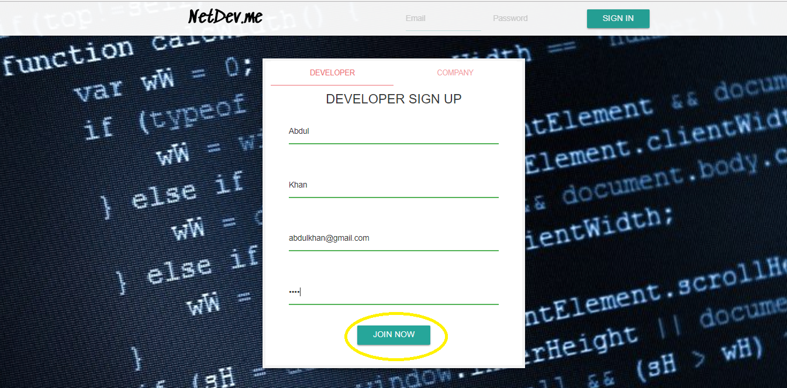

# NetDev.me

Heroku deployment coming soon
-------------------------------------
Community For Developer and Companies. This Project is still under development!
-------------------------------------

### Login/ Sign Up page. Below the user creates an account and clicks the sign up button

### Here the user will login with the email and password from when they signed up

### Once the user signs in, they will be redirected to the homepage. The user can then select the profile icon to
go to his/her profile. 
(Other icons are working, but the components are still under construction)

### This is what the user profile looks initially. The user can then click the icon to edit their Intro/BIO section. (Modal will appear)

### In this modal, the user can edit their first name, last name, and thier Bio. The user below edits thier bio and clicks submit to save the changes to the MongoDB/Mongoose database

### Once the user clicks submit, the modal closes and the edited BIO can be seen on their profile

## Built With

* JavaScript
* React 
* WebPack
* MongoDB
* Mongoose ODM
* Passport.js
* Node.js
* Express.js
* React-Materialize

-----------------------------------

## Authors

This was a group project the in the Rutgers Coding Bootcamp.  
The original group work can be found [HERE](https://github.com/Neex0202/FinalProject)

### Original Authors Include:

* Abdul Khan (me)
* Jacob Erling-- 
* Nico Santa Ana-- [Github](https://github.com/Neex0202)
* Varun --

------------------------------
## Acknowledgments

### Thanks to my group in Rutgers Coding Bootcamp who made this such a fun and challenging project! 